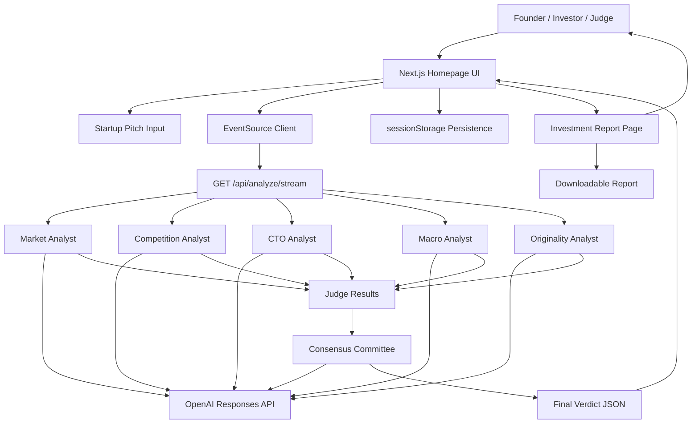
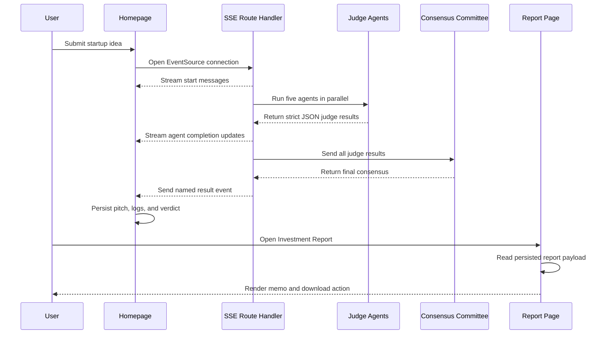

# TruthLens

**AI-powered investment committee for startup ideas.**

TruthLens is a multi-agent startup diligence system that turns a raw startup idea into an investment committee style analysis. Founders, builders, hackathon teams, and investors can paste an idea, watch specialist AI analysts evaluate it in real time, and open a full investment report with scores, risks, opportunities, recommendations, and killer questions.

Built for the OpenAI Codex Hackathon, designed as a production-quality open-source project, and structured for future contributors.

## Table of Contents

- [Problem Statement](#problem-statement)
- [Solution](#solution)
- [Key Features](#key-features)
- [System Architecture](#system-architecture)
- [Agent Descriptions](#agent-descriptions)
  - [Market Analyst](#market-analyst)
  - [Competition Analyst](#competition-analyst)
  - [CTO Analyst](#cto-analyst)
  - [Macro Analyst](#macro-analyst)
  - [Originality Analyst](#originality-analyst)
  - [Consensus Committee](#consensus-committee)
- [Technology Stack](#technology-stack)
- [Project Structure](#project-structure)
- [Analysis Flow](#analysis-flow)
- [Environment Variables](#environment-variables)
- [Local Development](#local-development)
- [Deployment Guide](#deployment-guide)
- [Future Roadmap](#future-roadmap)
- [Hackathon Notes](#hackathon-notes)
- [Screenshots](#screenshots)
- [Contributing](#contributing)
- [License](#license)

## Problem Statement

Founders often spend months building products before they receive rigorous, structured feedback. The earliest phase of startup validation is especially noisy:

- Founders waste months building bad ideas because early feedback is fragmented, overly polite, or too late.
- Advice is often subjective, inconsistent, and dependent on who happens to be in the room.
- Early-stage validation is difficult because strong startup judgment requires simultaneous evaluation of market pull, competition, technical feasibility, timing, originality, and investor readiness.

TruthLens addresses this by simulating a compact investment committee that can stress-test a startup idea immediately.

## Solution

TruthLens accepts a startup idea as input and returns a structured multi-agent diligence report.

**Input**

- Startup idea, founder narrative, raw pitch, or market thesis.

**Output**

- Multi-agent analysis from five specialist AI judges.
- Investment score.
- Biggest risks.
- Biggest opportunities.
- Recommendation: `Proceed`, `Validate Further`, or `Pass`.
- Killer questions for founder discovery and diligence.
- Full investment report with summary, judge analysis, and downloadable memo.

The product combines a real-time analysis interface with a report page designed to feel like a premium investment memo. The homepage streams progress through a terminal-style feed while agents run, then promotes the completed investment report as the primary post-analysis action.

## Key Features

- **AI Agent Swarm**: Five specialist analysts independently evaluate the same startup pitch.
- **Parallel Execution**: Market, competition, CTO, macro, and originality agents run concurrently for faster diligence.
- **Real-Time Terminal Feed**: Server-Sent Events stream live progress updates from the backend.
- **Investment Committee Consensus**: A final consensus agent synthesizes all judge outputs into one investment decision.
- **Open Report**: A prominent post-analysis CTA opens the full investment committee report.
- **Killer Questions**: Every judge produces a high-leverage question designed to pressure-test the idea.
- **Downloadable Report**: The report page can export a text investment memo.
- **GPT-5.5 Powered Analysis**: Agents use the OpenAI Responses API and default to `gpt-5.5` through `OPENAI_MODEL`.

## System Architecture

TruthLens uses a Next.js App Router frontend, a streaming Route Handler, and a set of OpenAI-powered server-side agents.



### Architectural Notes

- The browser starts analysis with an `EventSource` connection.
- The Route Handler returns `text/event-stream` and streams status updates as each phase completes.
- Five judge agents run in parallel with `Promise.all`.
- Each judge uses strict JSON schema output validation.
- The consensus agent receives all judge results and produces the investment committee output.
- The homepage persists the latest pitch, logs, and verdict in `sessionStorage`, allowing report navigation and browser back behavior to restore state.
- The report page reads the same persisted payload and renders the memo.

## Agent Descriptions

All judge agents return a shared typed shape:

```ts
export type JudgeResult = {
  score: number
  verdict: string
  killerQuestion: string
}
```

### Market Analyst

**Purpose**

Evaluates whether the idea has real product-market fit potential.

**Prompt Strategy**

The market agent is instructed to evaluate only product-market fit. It focuses on whether the user has described a real buyer pain, urgent demand, repeat usage, willingness to pay, and a credible wedge into the market.

**Output**

- `score`: Numeric product-market fit score.
- `verdict`: Concise explanation of market pull and weakness.
- `killerQuestion`: One question that tests whether demand is real.

### Competition Analyst

**Purpose**

Evaluates competitive pressure and defensibility.

**Prompt Strategy**

The competition agent uses a Five Forces inspired lens:

- Rivalry.
- Substitutes.
- New entrants.
- Buyer power.
- Supplier power.

It tests whether the idea is differentiated, whether incumbents can copy it, and whether the startup can defend distribution, workflow depth, or proprietary insight.

**Output**

- `score`: Numeric competitive pressure score.
- `verdict`: Competitive landscape and defensibility analysis.
- `killerQuestion`: One question that exposes the biggest competitive risk.

### CTO Analyst

**Purpose**

Evaluates technical execution risk.

**Prompt Strategy**

The CTO agent focuses only on technical feasibility:

- Technical assumptions.
- Hidden complexity.
- Scalability risks.
- Integration risk.
- Operational reliability.

It separates demo feasibility from production-grade execution.

**Output**

- `score`: Numeric technical execution risk score.
- `verdict`: Technical feasibility and implementation risk analysis.
- `killerQuestion`: One question that tests whether the build is truly feasible.

### Macro Analyst

**Purpose**

Evaluates whether the market timing is favorable.

**Prompt Strategy**

The macro agent analyzes only readiness and timing:

- Market timing.
- Trends.
- Adoption readiness.
- Regulatory, economic, or behavioral shifts.

It asks whether the startup is entering at the right moment or forcing a market that is not ready.

**Output**

- `score`: Numeric macro readiness score.
- `verdict`: Timing, trend, and adoption readiness analysis.
- `killerQuestion`: One question that tests whether the timing is real.

### Originality Analyst

**Purpose**

Evaluates whether the idea has non-obvious founder insight.

**Prompt Strategy**

The originality agent focuses only on:

- Originality.
- Founder insight.
- Fake startup risk.
- Whether the idea is a generic wrapper or contains a unique wedge.

It is intentionally skeptical of obvious startup tropes.

**Output**

- `score`: Numeric originality score.
- `verdict`: Analysis of insight, novelty, and imitation risk.
- `killerQuestion`: One question that forces the founder to reveal unique insight.

### Consensus Committee

**Purpose**

Synthesizes all five judge results into a final investment committee decision.

**Prompt Strategy**

The consensus agent acts as an investment committee chair. It receives the full structured output from every specialist agent and produces one final decision.

The recommendation must be exactly one of:

- `Proceed`
- `Validate Further`
- `Pass`

**Output**

```ts
export type ConsensusResult = {
  finalScore: number
  biggestRisk: string
  biggestOpportunity: string
  recommendation: string
}
```

## Technology Stack

### Frontend

- **Next.js 15+ App Router**  
  The repository is currently pinned to `next@16.2.6`, while using the same App Router architecture requested for a modern Next.js 15+ project.
- **React**
- **TypeScript**
- **Tailwind CSS**
- **shadcn/ui**
- **Framer Motion**
- **lucide-react**

### Backend

- **Next.js Route Handlers**
- **Server-Sent Events**
- **ReadableStream**
- **Strict JSON schema validation**

### AI

- **OpenAI Responses API**
- **GPT-5.5** through `OPENAI_MODEL`
- **openai Node SDK**

### Deployment

- **Vercel**

## Project Structure

```text
verdict-ai/
├── app/
│   ├── api/
│   │   └── analyze/
│   │       └── stream/
│   │           └── route.ts
│   ├── globals.css
│   ├── layout.tsx
│   ├── page.tsx
│   └── report/
│       └── page.tsx
├── components/
│   ├── theme-provider.tsx
│   └── ui/
│       ├── badge.tsx
│       ├── button.tsx
│       ├── card.tsx
│       ├── progress.tsx
│       ├── tabs.tsx
│       └── textarea.tsx
├── hooks/
├── lib/
│   ├── agents/
│   │   ├── analyze.ts
│   │   ├── competition.ts
│   │   ├── consensus.ts
│   │   ├── cto.ts
│   │   ├── macro.ts
│   │   ├── market.ts
│   │   ├── originality.ts
│   │   └── types.ts
│   ├── report.ts
│   └── utils.ts
├── public/
├── components.json
├── eslint.config.mjs
├── next.config.ts
├── package.json
├── postcss.config.mjs
├── README.md
└── tsconfig.json
```

### Folder Responsibilities

- `app/`: Next.js App Router pages, layout, global styles, and route handlers.
- `app/page.tsx`: Main pitch input, live progress feed, dashboard, and post-analysis report CTA.
- `app/report/page.tsx`: Full investment memo page with summary, judge analysis, print-friendly layout, and download support.
- `app/api/analyze/stream/route.ts`: SSE endpoint that orchestrates the analysis pipeline.
- `components/`: Shared UI and theme components.
- `components/ui/`: shadcn-style primitives used throughout the interface.
- `lib/agents/`: OpenAI-powered specialist agents and consensus logic.
- `lib/report.ts`: Shared report payload types and storage keys.
- `lib/utils.ts`: Utility helpers.
- `public/`: Static assets.
- `hooks/`: Reserved for shared React hooks as the product grows.

## Analysis Flow

1. **User submits idea**  
   The founder enters a startup idea or pitch on the homepage and clicks `Analyze Idea`.

2. **SSE starts**  
   The browser opens an `EventSource` connection to:

   ```ts
   /api/analyze/stream?pitch=...
   ```

3. **Agents launch in parallel**  
   The server streams start messages and launches all five judge agents concurrently.

4. **Agent results collected**  
   Each agent returns a strict JSON object containing `score`, `verdict`, and `killerQuestion`.

5. **Consensus generated**  
   Once all judge agents finish, the consensus agent synthesizes their outputs into a final score, risk, opportunity, and recommendation.

6. **Report created**  
   The final verdict is sent as a named SSE `result` event, stored in browser session state, and made available to the report page.

7. **User reviews report**  
   The user opens the investment report, reviews the memo, prints it, or downloads the text report.



## Environment Variables

TruthLens requires an OpenAI API key for live analysis.

| Variable | Required | Description |
| --- | --- | --- |
| `OPENAI_API_KEY` | Yes | API key used by all OpenAI-powered agents. |
| `OPENAI_MODEL` | No | Model used by agents. Defaults to `gpt-5.5`. |

Example `.env.local`:

```bash
OPENAI_API_KEY=your_openai_api_key_here
OPENAI_MODEL=gpt-5.5
```

## Local Development

Install dependencies:

```bash
npm install
```

Start the development server:

```bash
npm run dev
```

Open the local URL printed by Next.js, usually:

```bash
http://localhost:3000
```

Run quality checks:

```bash
npm run typecheck
npm run lint
npm run build
```

Other useful scripts:

```bash
npm run start
npm run format
```

## Deployment Guide

TruthLens is designed for deployment on Vercel.

### 1. Push to GitHub

Commit the project and push it to a GitHub repository.

```bash
git add .
git commit -m "Prepare TruthLens for deployment"
git push origin main
```

### 2. Import into Vercel

1. Open Vercel.
2. Select `Add New Project`.
3. Import the GitHub repository.
4. Use the default Next.js framework settings.

### 3. Add Environment Variables

In Vercel project settings, add:

```bash
OPENAI_API_KEY=your_openai_api_key_here
OPENAI_MODEL=gpt-5.5
```

### 4. Build Settings

Use the default commands:

```bash
npm install
npm run build
```

The production start command is handled by Vercel for Next.js deployments.

### 5. Domain Setup

1. Open the Vercel project dashboard.
2. Go to `Settings` -> `Domains`.
3. Add a custom domain.
4. Configure DNS records as instructed by Vercel.
5. Confirm SSL provisioning.

## Future Roadmap

- **Startup Graveyard**: Expand the failure-pattern database into a richer benchmarking surface.
- **Competitor Discovery**: Automatically identify likely competitors and substitutes.
- **Market Sizing**: Estimate TAM, SAM, SOM, and buyer budget intensity.
- **Investor Matching**: Match ideas with relevant investor theses and funds.
- **PDF Export**: Generate polished PDF investment memos.
- **Team Analysis**: Evaluate founder-market fit and team risk.
- **Due Diligence Mode**: Add deeper workflows for financials, GTM, compliance, and customer discovery.
- **Saved Reports**: Persist multiple analyses and compare them over time.
- **Shareable Links**: Allow founders to share report URLs with advisors and investors.
- **Agent Tuning Panel**: Let users adjust judge strictness and scoring weights.

## Hackathon Notes

TruthLens was built with OpenAI Codex as a collaborative engineering partner.

### Why Codex Was Used

Codex accelerated the project from concept to working product by helping with:

- Next.js App Router scaffolding.
- TypeScript data modeling.
- Agent orchestration design.
- SSE streaming implementation.
- UI iteration and visual polish.
- README and developer documentation.

### How Codex Accelerated Development

The project moved quickly because Codex could reason across frontend, backend, and AI orchestration at the same time. Instead of treating the UI, streaming route, and agents as separate tasks, Codex helped keep the end-to-end workflow coherent:

- Pitch input.
- Real-time progress feed.
- Parallel agent execution.
- Consensus synthesis.
- Report persistence.
- Investment memo rendering.

### Where Codex Generated Code

Codex contributed across the codebase, including:

- `app/page.tsx`: Homepage, analysis flow, state persistence, and primary CTA.
- `app/api/analyze/stream/route.ts`: SSE orchestration endpoint.
- `app/report/page.tsx`: Report rendering, download support, and memo layout.
- `lib/agents/*`: Specialist agent implementations and result validation.
- `lib/report.ts`: Shared report payload types and storage keys.
- `app/globals.css`: Visual system and theme tokens.

### Architectural Decisions Made With Codex

- Use **Server-Sent Events** instead of polling for a more transparent live analysis experience.
- Run judge agents in **parallel** for faster feedback.
- Use **strict JSON schema outputs** to keep AI responses reliable and typed.
- Store the latest analysis in **sessionStorage** so users can open a report and return without losing state.
- Keep the report page generated from real analysis output rather than static placeholder data.

## Screenshots

> Screenshots should be added before public launch or judging submission.

### Homepage


### Report Page


## Contributing

Contributions are welcome.

1. Fork the repository.
2. Create a feature branch.

   ```bash
   git checkout -b feature/your-feature-name
   ```

3. Install dependencies.

   ```bash
   npm install
   ```

4. Make your changes.
5. Run checks.

   ```bash
   npm run typecheck
   npm run lint
   npm run build
   ```

6. Open a pull request with a clear description of the change.

### Contribution Guidelines

- Keep agent outputs typed and validated.
- Do not introduce unstructured model responses into the UI.
- Keep the report page driven by real analysis data.
- Prefer small, focused pull requests.
- Document any new environment variables.

## License

MIT License.

This project is intended for open-source use, hackathon judging, and continued development.
